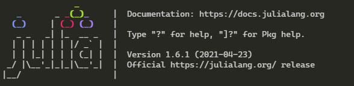
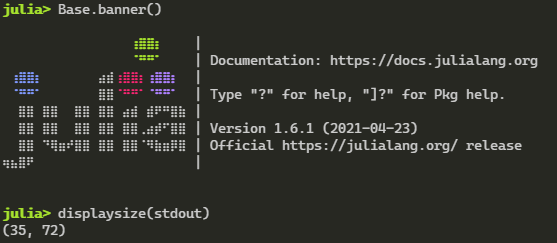
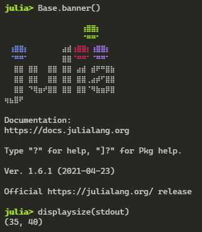

# BetterBanner.jl

## Motivation

This package was done to solve two issues with the start banner (`Base.banner()`):
1. from 1.6 onwards, there is a new `show` method for sparse matrices, that uses braille unicode to draw the sparsity pattern. despite of that, the julia start banner still uses ascii, and there are striking differences between the official logo and the logo recreated.

2. The current banner overflows easily. I have a terrible programming enviroment (by choice) where i choose to have a long, narrow terminal screen, and the display quality of the banner suffers each time. The fact that i saw some julia users on mobile phones (!!) with the same problem, pushed me over the edge to do this.

Lets see the current situation:



Seems right, but sometimes, i really want to start julia on a narrow terminal:


## The Solution

Enter BetterBanner.jl.

The package replaces the current banner art with one done with braille unicode:



It comes with some text overflow protection:




As with the original `Base.banner` function, there is also a `--color=no` mode:


## Usage

Add this package:
```julia
pkg>add https://github.com/longemen3000/BetterBanner.jl
```
and add this line to your `.julia//config//startup.jl` file (if the file or directory is not there, create it first): 

```julia
#startup.jl
import BetterBanner
```
And that's it. If you are concerned about performance, you can test it by:

```julia
#startup.jl
@time import BetterBanner
```

On my laptop, the loading time (julia 1.6.2) is the following:

```
C:\Users\longemen3000\.julia\dev>julia
  0.010768 seconds (9.41 k allocations: 790.844 KiB, 55.18% compilation time)
```